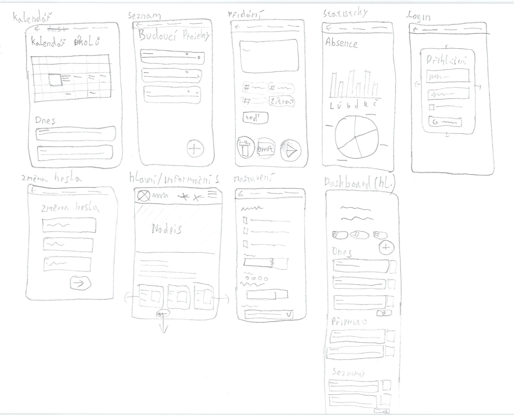
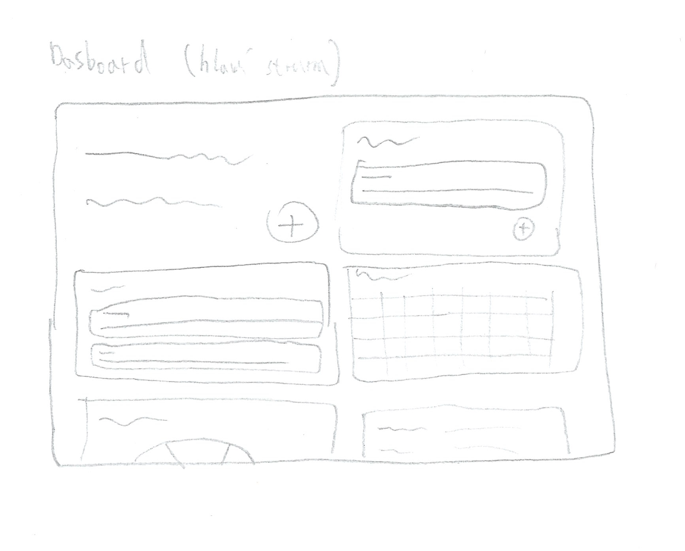
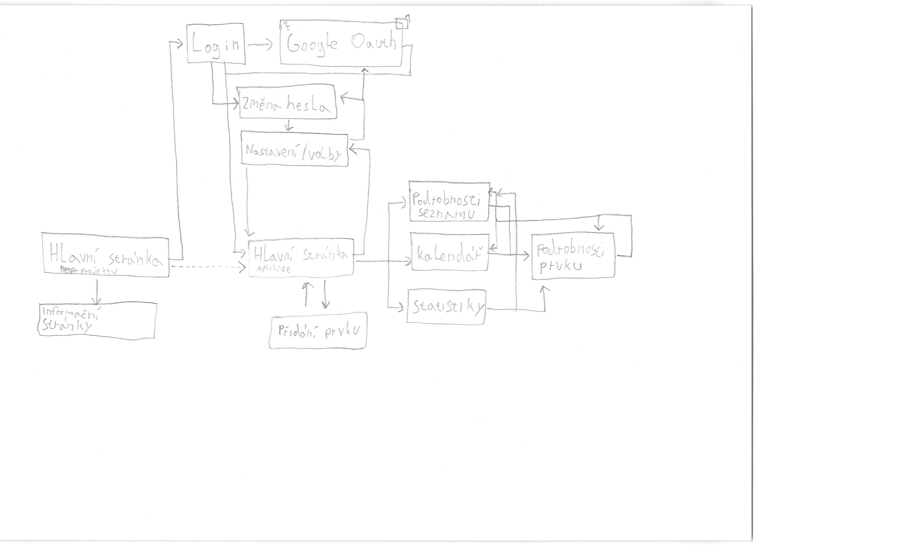

# Contextum

Contextum je webový nástroj navržený pro efektivní organizaci času a informací, který stírá hranici mezi klasickým úkolovníkem a osobním deníkem, záznamníkem, archivátorem a podobně. Umožňuje uživatelům spravovat úkoly, dělit je na detailní podúkoly a propojovat je s tematickými články nebo zpětnými záznamy o tom, co se v daný den událo či dít bude. Systém obsahuje inteligentní plánovač, který dokáže přiřazovat práci podle aktuálního volného času, a přehledné statistiky. Aplikace navíc podporuje integraci s externími zdroji, například s dokumenty na docs.honzaa.cz, a dovoluje vybrané záznamy či úkoly snadno zveřejnit, čímž vytváří ucelený prostor pro správu soukromých i veřejných projektů. 

## Návrh wireframe


## User flow diagram


## Odborný článek
Contextum bude webový <u>nástroj</u> určený pro efektivní <u>organizaci času</u> a systematickou <u>správu</u> informací. Tento <u>systém</u> úspěšně stírá tradiční hranice mezi běžným <u>úkolovníkem</u>, osobním <u>deníkem</u> a znalostním <u>archivátorem</u>. Jeho primárním cílem je poskytnout sjednocený <u>prostor</u> pro centralizovaný <u>management</u> soukromých i veřejných <u>projektů</u> a osobních věcí.

Základním stavebním kamenem aplikační logiky jsou <u>prvky (úkoly)</u>, které lze hierarchicky dekomponovat na detailní <u>podprvky (podúkoly)</u>. Tyto <u>entity</u> je možné sémanticky propojovat s tematickými články nebo seřazenými <u>záznamy</u> o denních událostech. Klíčovou komponentou je inteligentní <u>plánovač</u>, který využívá algoritmy pro automatizované přiřazování práce na základě definovaných časových oken a aktuálních kapacit. Pro vizualizaci uživatelské efektivity slouží analytický modul generující přehledné <u>statistiky</u>. (poznámka: Plánovač bude vytvořen v postupnější fázi projektu)

Architektura <u>aplikace</u> se dělí na tři uživatelské úrovně:

*  Anonymní <u>návštěvník</u>: Pohybuje se převážně na veřejných informačních stránkách. Má <u>oprávnění</u> ke čtení veřejné nápovědy a prvků zveřejněných uživatelem pro všechny.

*  Registrovaný <u>uživatel</u>: Do systému vstupuje přes zabezpečenou <u>autentizaci</u> (s podporou <u>protokolu</u> Google OAuth). Po úspěšném přihlášení je přesměrován na svůj personalizovaný <u>dashboard</u> (hlavní stránku aplikace). Zde probíhají jeho klíčové <u>aktivity</u>: iniciuje přidávání nových prvků, spravuje <u>kalendář</u>, analyzuje svou výkonnost nebo prochází <u>podrobnosti</u> jednotlivých seznamů a záznamů. Dále zde provádí změnu hesla, definuje osobní <u>nastavení</u> a spravuje <u>integrace</u> na externí <u>zdroje</u> (např. cloudové <u>dokumenty</u>).

  *  u>Administrátor</u>: Zajišťuje globální chod platformy. Kromě všech práv běžného klienta má přístup k pokročilé konfiguraci, moderaci obsahu a celkové <u>údržbě</u> uživatelských účtů.

Díky promyšlenému navigačnímu toku poskytuje Contextum vysoce flexibilní a propojené <u>prostředí</u> pro každodenní osobní i profesní <u>produktivitu</u>.

## Instalace

windows:
```
py -3 -m venv venv
source venv/Scripts/activate
pip install -r requirements.txt
```
