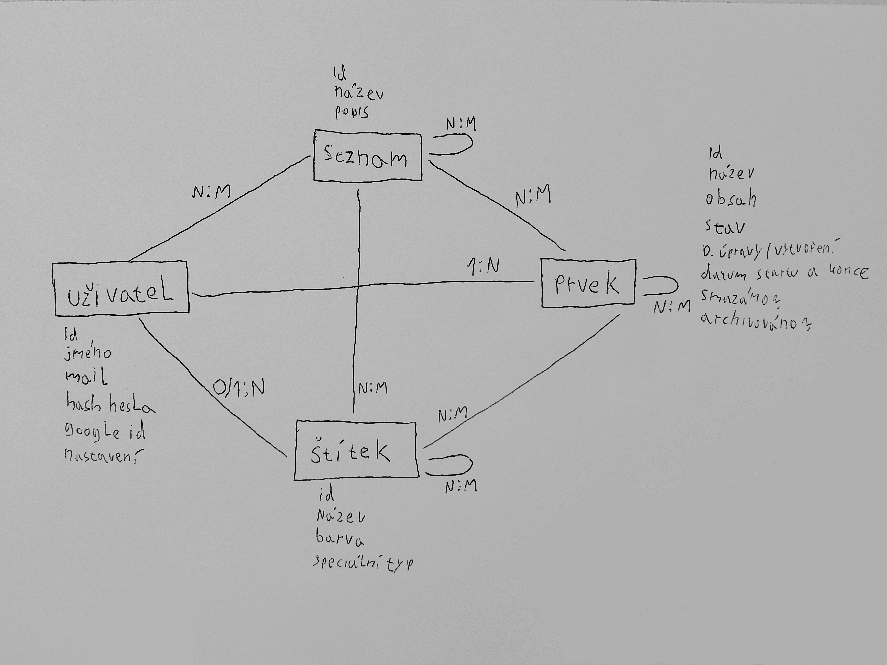

# Contextum

Contextum je webový nástroj navržený pro efektivní organizaci času a informací, který stírá hranici mezi klasickým úkolovníkem a osobním deníkem, záznamníkem, archivátorem a podobně. Umožňuje uživatelům spravovat úkoly, dělit je na detailní podúkoly a propojovat je s tematickými články nebo zpětnými záznamy o tom, co se v daný den událo či dít bude. Systém obsahuje inteligentní plánovač, který dokáže přiřazovat práci podle aktuálního volného času, a přehledné statistiky. Aplikace navíc podporuje integraci s externími zdroji, například s dokumenty na docs.honzaa.cz, a dovoluje vybrané záznamy či úkoly snadno zveřejnit, čímž vytváří ucelený prostor pro správu soukromých i veřejných projektů. 

## Návrh wireframe


## User flow diagram

## Schéma Databáze

## Odborný článek
Contextum bude webový <ins>nástroj</ins> určený pro efektivní <ins>organizaci času</ins> a systematickou <ins>správu</ins> informací. Tento <ins>systém</ins> úspěšně stírá tradiční hranice mezi běžným <ins>úkolovníkem</ins>, osobním <ins>deníkem</ins> a znalostním <ins>archivátorem</ins>. Jeho primárním cílem je poskytnout sjednocený <ins>prostor</ins> pro centralizovaný <ins>management</ins> soukromých i veřejných <ins>projektů</ins> a osobních věcí.

Základním stavebním kamenem aplikační logiky jsou <ins>prvky (úkoly)</ins>, které lze hierarchicky dekomponovat na detailní <ins>podprvky (podúkoly)</ins>. Tyto <ins>entity</ins> je možné sémanticky propojovat s tematickými články nebo seřazenými <ins>záznamy</ins> o denních událostech. Klíčovou komponentou je inteligentní <ins>plánovač</ins>, který využívá algoritmy pro automatizované přiřazování práce na základě definovaných časových oken a aktuálních kapacit. Pro vizualizaci uživatelské efektivity slouží analytický modul generující přehledné <ins>statistiky</ins>. (poznámka: Plánovač bude vytvořen v postupnější fázi projektu)

Architektura <ins>aplikace</ins> se dělí na tři uživatelské úrovně:

*  Anonymní <ins>návštěvník</ins>: Pohybuje se převážně na veřejných informačních stránkách. Má <ins>oprávnění</ins> ke čtení veřejné nápovědy a prvků zveřejněných uživatelem pro všechny.

*  Registrovaný <ins>uživatel</ins>: Do systému vstupuje přes zabezpečenou <ins>autentizaci</ins> (s podporou <ins>protokolu</ins> Google OAuth). Po úspěšném přihlášení je přesměrován na svůj personalizovaný <ins>dashboard</ins> (hlavní stránku aplikace). Zde probíhají jeho klíčové <ins>aktivity</ins>: iniciuje přidávání nových prvků, spravuje <ins>kalendář</ins>, analyzuje svou výkonnost nebo prochází <ins>podrobnosti</ins> jednotlivých seznamů a záznamů. Dále zde provádí změnu hesla, definuje osobní <ins>nastavení</ins> a spravuje <ins>integrace</ins> na externí <ins>zdroje</ins> (např. cloudové <ins>dokumenty</ins>).

  *  <ins>Administrátor</ins>: Zajišťuje globální chod platformy. Kromě všech práv běžného klienta má přístup k pokročilé konfiguraci, moderaci obsahu a celkové <ins>údržbě</ins> uživatelských účtů.

Díky promyšlenému navigačnímu toku poskytuje Contextum vysoce flexibilní a propojené <ins>prostředí</ins> pro každodenní osobní i profesní <ins>produktivitu</ins>.

## Instalace
> [!NOTE]
> Tato sekce byla vypůjčena z jiného [wt_prj](https://github.com/gyarab/2025_wt_prj_tlamka), kterému na ni spadají veškerá práva.
## 2. Aktivace prostředí

### Linux (Popř. Git Bash / WSL /  macOS)

```bash
source .venv/bin/activate
```

### Windows – PowerShell

```bash
.venv\Scripts\Activate.ps1
```

### Windows – Příkazový řádek (cmd)

```bash
.venv\Scripts\activate.bat
```

Pokud nefunguje:

```bash
Set-ExecutionPolicy -Scope CurrentUser -ExecutionPolicy RemoteSigned
```

---

## 3. Instalace závislostí

Aktualizace pip:

```bash
python -m pip install --upgrade pip setuptools wheel
```

Instalace projektu:

```bash
pip install -r requirements.txt
```

---

## 4. Spuštění aplikace

### Django

```bash
python3 manage.py runserver
```
